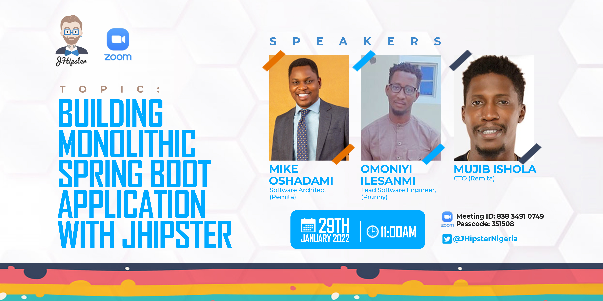

# Building-Monolithic-Spring-Boot-Application-with-JHipster

This event will give you quick information about JHipster and show you how can you create a fully configured Monolithic Spring Boot application with custom entities.  You will learn how to generate a web application that includes tooling from development build scripts to production docker configurations.
The following topics are covered in this webinar:

What is JHipster?

Example monolith application walkthrough (command line)

What is JDL?

JDL Studio

Example JDL in monolithic application

JHipster Continuous Integration (CI)

Deploying JHipster monolithic application to Heroku

What’s next?

How to contribute

Q & A

Event Link: https://www.meetup.com/jhipster-nigeria/events/282021590
